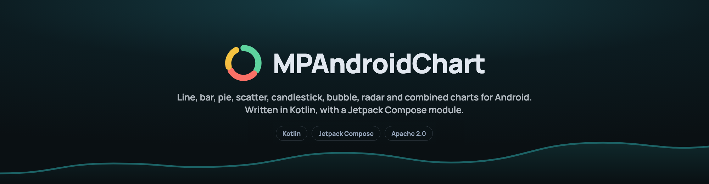
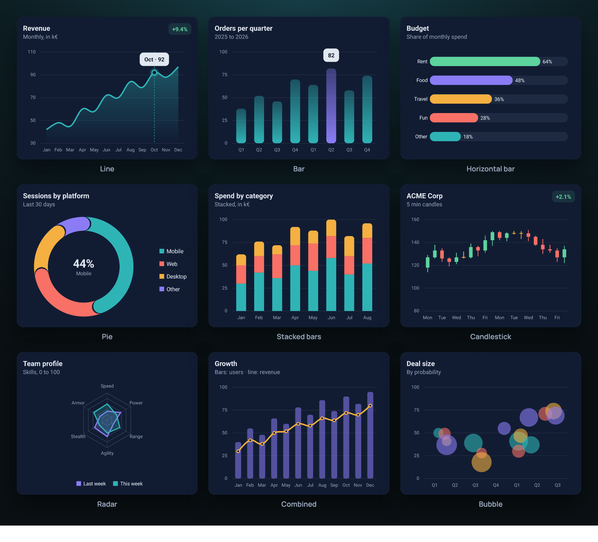
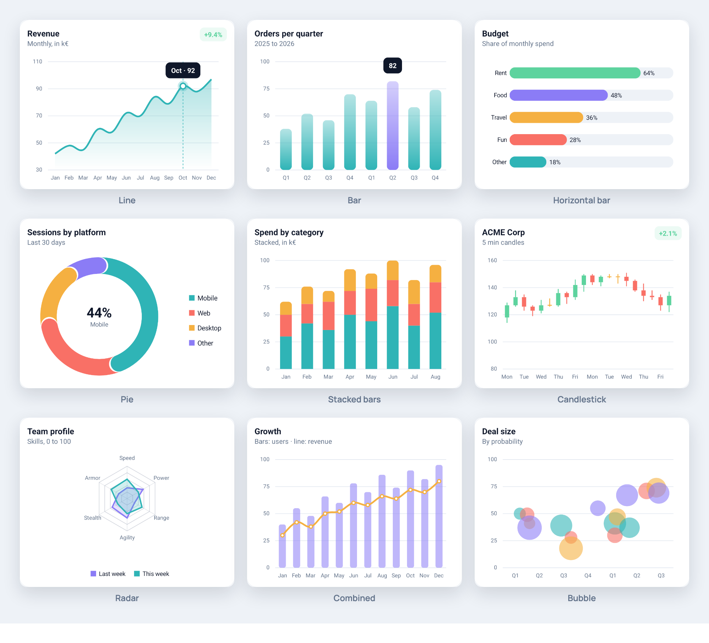

[](https://jitpack.io/#PhilJay/MPAndroidChart)
[](https://android-arsenal.com/api?level=23)

**The charting library Android has relied on since 2014, rewritten from the ground up in Kotlin.** Nine chart types, a Jetpack Compose module and a property based API, with zooming, dragging, highlighting, markers, animations and styling control over every pixel. **Thirty thousand points stay smooth**, one dependency line gets you started, and 35 chapters of guides cover the rest.

[Charts](https://github.com/danielgindi/Charts) is the iOS version of this library.

## Support the project

If this library helps you, [a donation](https://www.paypal.com/cgi-bin/webscr?cmd=_s-xclick&hosted_button_id=EGBENAC5XBCKS) is appreciated.

## Gallery

The example app opens with every chart type in one consistent style, in a dark and a light variant, drawn by the library. The styling code is in `MPChartExample/src/main/kotlin/com/xxmassdeveloper/mpchartexample/design/`.



<video src="https://philjay.cc/mpandroidchart/media/teaser.mp4" poster="https://philjay.cc/mpandroidchart/media/teaser-poster.jpg" controls muted playsinline width="100%"></video>

[Watch the overview](https://philjay.cc/mpandroidchart/media/teaser.mp4): twenty two seconds through the chart types, the styling, thirty thousand points and the code it takes.



## Documentation

The guides at [philjay.cc](https://philjay.cc/mpandroidchart/docs/) cover the library in 35 chapters, from a first chart to theming, Compose, custom renderers and troubleshooting. Every class, function and property also has KDoc, and the generated API reference is served by JitPack for each release: [MPChartLib](https://jitpack.io/com/github/PhilJay/MPAndroidChart/MPChartLib/v4.0.1/javadoc/) and [MPChartCompose](https://jitpack.io/com/github/PhilJay/MPAndroidChart/MPChartCompose/v4.0.1/javadoc/). To build it locally run `./gradlew dokkaGenerate` and open `build/dokka/html/index.html`.

## Requirements

minSdk 23, compileSdk 35, Java 17 and Kotlin 2.0 or newer. The Compose module needs compileSdk 37, because Compose itself does. Java callers need no Kotlin at all. Coming from the Java 3.x versions? Read [MIGRATION.md](MIGRATION.md) or the longer [migration guide](https://philjay.cc/mpandroidchart/docs/migration/). [CHANGELOG.md](CHANGELOG.md) lists what changed in 4.0.

## Install

4.0 is a rewrite in Kotlin. Its coordinates differ from 3.x, so a project on the 3.x coordinates `com.github.PhilJay:MPAndroidChart` keeps building untouched. Pin the version, do not track the newest one.

```kotlin
// settings.gradle.kts
dependencyResolutionManagement {
    repositories {
        maven("https://jitpack.io")
    }
}

// build.gradle.kts
dependencies {
    implementation("com.github.PhilJay.MPAndroidChart:MPChartLib:v4.0.1")
    implementation("com.github.PhilJay.MPAndroidChart:MPChartCompose:v4.0.1") // only for Compose
}
```

## Quick start with Compose

Every chart type has a composable with the same name. Pass data as state, configure the view once in `setup`, and read selection and viewport back through the state:

```kotlin
val state = rememberChartState()
LaunchedEffect(lineData) { state.animateX(500) }

LineChart(
    data = lineData,
    modifier = Modifier.fillMaxWidth().height(300.dp),
    state = state,
    marker = { entry, _ -> Text("${entry.y}") },
    setup = {
        description.isEnabled = false
        axisRight.isEnabled = false
    },
)
```

`setup` runs once. `ChartState` exposes `selectedEntry`, the visible range and the zoom, and offers `highlight`, `zoomIn`, `fitScreen`, `moveViewToX` and the animate functions. The [Compose chapter](https://philjay.cc/mpandroidchart/docs/compose/) covers state, markers, previews and the Compose colour and typeface helpers.

## Quick start with Views

Put a chart in a layout, then give it data. Entries are points, a data set is one series with its styling, and the data object holds all series of a chart:

```kotlin
val entries = listOf(Entry(0f, 4f), Entry(1f, 8f), Entry(2f, 6f))
val set = LineDataSet(entries, "Sales").apply {
    color = Color.BLUE
    lineWidth = 2f
    mode = LineDataSet.Mode.CUBIC_BEZIER
}
chart.data = LineData(set)
chart.animateX(500)
```

Every chart type follows the same pattern: `BarEntry` into `BarDataSet` into `BarData` for a `BarChart`, and so on. Everything is configured through properties, and formatters and listeners are lambdas:

```kotlin
chart.xAxis.position = XAxis.XAxisPosition.BOTTOM
chart.axisRight.isEnabled = false
chart.xAxis.valueFormatter = IAxisValueFormatter { value, _ -> months[value.toInt()] }
chart.onValueSelected { entry, _ -> showDetails(entry) }
```

Entries can also carry your own object: `Entry(1f, 2f, data = order)` is an `Entry<Order>`, and the payload comes back typed from lookups and selections.

To change data later, assign a new data object or edit the entries and call `chart.notifyDataSetChanged()`, which also redraws. The [guides](https://philjay.cc/mpandroidchart/docs/) cover axes, markers, styling and the rest.

## Example app

The `MPChartExample` module in this repository shows every chart type and feature, starting with the showcase above, plus Compose screens. Open the project in Android Studio and run it.

## Questions and issues

The issue tracker is for bugs and feature requests. Ask usage questions on [Stack Overflow](https://stackoverflow.com/questions/tagged/mpandroidchart) with the `mpandroidchart` tag.

## License

Copyright 2014-2026 Philipp Jahoda

Licensed under the Apache License, Version 2.0. [LICENSE](LICENSE) holds the full text and [NOTICE](NOTICE) the attribution.

## Special thanks

- [danielgindi](https://github.com/danielgindi) - Daniel Gindi
- [mikegr](https://github.com/mikegr) - Michael Greifeneder
- [tony](https://github.com/tonypatino-monoclesociety) - Tony
- [almic](https://github.com/almic) - Mick A.
- [jitpack.io](https://github.com/jitpack-io) - JitPack.io
